# Engineering Specification: Convergent Threat Solutions Development Center

## 1. Executive Summary & Mission

The **Convergent Threat Solutions Development Center** is a next-generation, agentic programming environment for macOS and iPadOS, with a focus on Apple's M4 architecture. It serves as the primary command interface and Integrated Development Environment (IDE) for a sophisticated, Rust-powered backend.

**Mission**: To provide a seamless, powerful, and intuitive platform for designing, simulating, and certifying the advanced cognitive and cybersecurity tools required by enterprise, DoD, and critical infrastructure clients.

## 2. Core Backend Architecture

The Development Center is the front-end for a cohesive, powerful backend ecosystem.

### 2.1 Hybrid Orchestration Engine
A dual-runtime system that provides maximum flexibility and performance:

- **Legion ECS**: A heavily modified gaming engine for high-speed, multi-domain simulations ("worlds") and cognitive defense tactics like "Twinning."
- **Windmill**: A robust, distributed job engine for flexible, script-based workflows.

### 2.2 CTAS Assembly Language (AL)
The foundational language of the entire system. It is a hybrid language combining:

- **Unicode**: As compressed, self-executing operational "verbs."
- **Base96 Trivariate Hashes**: As unique, context-aware "nouns" representing all data and entities (SCH, CUID, UUID).
- **Lisp S-Expressions**: As the grammatical structure.

### 2.3 Smart Crate System
A secure "foundry" for producing and certifying all deployable software components ("Crates"). Each crate has:
- Comprehensive JSON dossier ("Crate Interview")
- Multi-stage certification pipeline (double-blockchain + PGP keys)
- Portable deployment package (Docker, Firefly IaC, WASM files)

### 2.4 Cognitive Memory Architecture
A three-layered memory system for LLM agents, inspired by the human brain:

- **Layer 1 (Working Memory)**: High-speed Sled KVS for immediate context
- **Layer 2 (Episodic Memory)**: Supabase (PostgreSQL) for chronological log of experiences
- **Layer 3 (Semantic Memory)**: SurrealDB for long-term, searchable knowledge base of vectorized insights

### 2.5 Neural Mux
The operational, AI-driven (Phi-3) I/O and traffic routing engine that acts as the intelligent gateway for the entire system.

## 3. Application Specification: The SwiftUI App

The Development Center app will be built using SwiftUI for native performance on macOS, iPadOS, and iOS, featuring an adaptive UI that provides an optimal experience on any device.

### 3.1 Key Modules & Features

#### IaC Studio
- Cost-first, asset-optional Infrastructure as Code management
- Logical design canvas
- Real-time cost simulator
- Library of blueprints to democratize infrastructure deployment

#### Simulations Module
- Primary control panel for the Legion ECS
- Management of Land, Space, and Cyber "worlds"
- Provision "Digital Twins" of client infrastructure
- Deploy Adversary Tasks for wargaming and cognitive defense

#### Agent Control & Cognition Inspector
- Interface for directing AI agents
- Inspect three-layered memory systems
- View live MCP traffic

#### Crates Module & Provisioning Dashboard
- Manage Smart Crate lifecycle
- View "Crate Interview" dossier
- Access secure build artifacts for deployment

#### DevOps Module
- Hub for project management
- Deep Linear integration
- Interactive Kanban board
- DevSecOps compliance checklists

#### Tools Arsenal & Dossier Viewer
- Unified interface for browsing all system entities
- Browse Tools, Tasks, Crates via rich JSON "dossier"

#### GIS Viewer
- Integrated mapping component for visualizing simulations

## 4. System Architecture Diagram

```mermaid
graph TD
    subgraph "🖥️ User Interface Layer"
        A[💻 Development Center App<br/>SwiftUI for macOS/iPadOS/iOS]
        A1[IaC Studio]
        A2[Simulations Module]
        A3[Agent Control & Cognition Inspector]
        A4[Crates Module & Provisioning Dashboard]
        A5[DevOps Module]
        A6[Tools Arsenal & Dossier Viewer]
        A7[GIS Viewer]

        A --> A1 & A2 & A3 & A4 & A5 & A6 & A7
    end

    subgraph "🦀 Backend Services Layer"
        B[Rust Backend<br/>MCP Server & Business Logic]
        B1[🧠 Neural Mux<br/>AI-Driven I/O Router]
        B2[🔐 Smart Crate System<br/>Secure Component Foundry]
        B3[🤖 AI/LLM Services<br/>Claude SDK, Phi-3]

        B --> B1 & B2 & B3
    end

    subgraph "⚡ Execution Runtimes"
        D[🏎️ Legion ECS<br/>High-Speed Simulations]
        E[📜 Windmill<br/>Distributed Job Engine]

        D1[Land World]
        D2[Space World]
        D3[Cyber World]
        D4[Digital Twins]

        D --> D1 & D2 & D3 & D4
    end

    subgraph "💾 Persistence Layer"
        F[🔥 Sled KVS<br/>Working Memory<br/>Layer 1]
        G[💧 Supabase PostgreSQL<br/>Episodic Memory<br/>Layer 2]
        H[❄️ SurrealDB<br/>Semantic Memory<br/>Layer 3]
        I[🌍 Slot Graph<br/>World State]
    end

    subgraph "🔤 CTAS Assembly Language"
        J[Unicode Verbs]
        K[Base96 Trivariate Hashes]
        L[Lisp S-Expressions]
    end

    %% Primary Data Flow
    A <==> B
    B <==> B1
    B1 <==> D & E
    B <==> B3

    %% Memory Architecture
    B1 <==> F
    B1 <==> G
    B1 <==> H
    D <==> I

    %% Assembly Language Integration
    B <==> J & K & L

    %% Styling
    classDef uiLayer fill:#e1f5fe
    classDef backendLayer fill:#f3e5f5
    classDef runtimeLayer fill:#fff3e0
    classDef persistenceLayer fill:#e8f5e8
    classDef languageLayer fill:#fff8e1

    class A,A1,A2,A3,A4,A5,A6,A7 uiLayer
    class B,B1,B2,B3 backendLayer
    class D,E,D1,D2,D3,D4 runtimeLayer
    class F,G,H,I persistenceLayer
    class J,K,L languageLayer
```

## 5. Technical Stack Summary

### Frontend
- **SwiftUI** - Native iOS/macOS/iPadOS interface
- **Core Data** - Local data persistence
- **Combine** - Reactive programming
- **Charts** - Data visualization

### Backend
- **Rust** - High-performance backend services
- **MCP (Model Context Protocol)** - AI agent communication
- **Legion ECS** - Entity Component System for simulations
- **Windmill** - Workflow automation

### Data Storage
- **Sled** - Embedded key-value store (Working Memory)
- **Supabase** - PostgreSQL for structured data (Episodic Memory)
- **SurrealDB** - Multi-model database for graph/vector data (Semantic Memory)

### AI/ML
- **Claude SDK** - Large language model integration
- **Phi-3** - Lightweight AI model for Neural Mux
- **Vector Embeddings** - Semantic search and retrieval

## 6. Security & Compliance

### Certification Pipeline
- **Double-Blockchain** - Immutable audit trail
- **PGP Key Management** - Cryptographic signing
- **Multi-Stage Validation** - Comprehensive security checks

### Enterprise Requirements
- **DoD Compliance** - Military-grade security standards
- **Enterprise Integration** - Seamless workflow integration
- **Critical Infrastructure** - High-availability and reliability

## 7. Development Roadmap

### Phase 1: Foundation
- [ ] Core SwiftUI application structure
- [ ] Basic MCP communication layer
- [ ] Initial data models and persistence

### Phase 2: Core Modules
- [ ] IaC Studio implementation
- [ ] Simulations Module development
- [ ] Agent Control interface

### Phase 3: Advanced Features
- [ ] Cognitive Memory Architecture
- [ ] Smart Crate System
- [ ] Neural Mux integration

### Phase 4: Enterprise Features
- [ ] DevOps Module completion
- [ ] Security certification pipeline
- [ ] Performance optimization

---

**Document Version**: 1.0
**Last Updated**: October 7, 2025
**Classification**: Engineering Specification
**Target Platform**: macOS M4, iPadOS, iOS