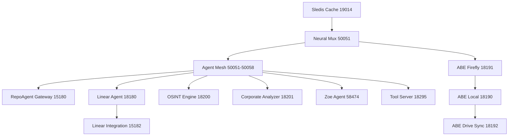

# PM2 Service Hierarchy & Organization
## CTAS-7 Command Center Dashboard Architecture

---

## 📊 Complete Service Buckets (Tiers)

```
┌───────────────────────────────────────────────────────────────────────────────┐
│                           TIER 0: DOCUMENT INTELLIGENCE                       │
│                                     (ABE)                                     │
├─────────────────────────┬─────────────────────────┬───────────────────────────┤
│  abe-local (18190)      │  abe-firefly (18191)    │  abe-drive-sync (18192)  │
│  • Document classifier  │  • WASM processing      │  • Google Drive sync     │
│  • Metadata extraction  │  • Hash retrieval       │  • MS Office export      │
│  • MARC 21 cataloging   │  • Memory Fabric        │  • Service account auth  │
└─────────────────────────┴─────────────────────────┴───────────────────────────┘
                                        │
                                        ↓
┌───────────────────────────────────────────────────────────────────────────────┐
│                     TIER 1: CORE AGENT INFRASTRUCTURE                         │
├───────────────────────────────────────┬───────────────────────────────────────┤
│  repoagent-gateway (15180)            │  agent-mesh (50051-50058)             │
│  • HTTP/REST entry point              │  • Claude Meta-Agent (50055)          │
│  • X-API-Key auth                     │  • Natasha (50052)                    │
│  • External API access                │  • Grok (50051)                       │
│  • Routes to agent mesh               │  • Cove (50053)                       │
│                                       │  • Altair (50054)                     │
│                                       │  • GPT (50056)                        │
│                                       │  • Gemini (50057)                     │
│                                       │  • ABE Agent (50058)                  │
└───────────────────────────────────────┴───────────────────────────────────────┘
                                        │
                                        ↓
┌───────────────────────────────────────────────────────────────────────────────┐
│                        TIER 2: LINEAR INTEGRATION                             │
├───────────────────────────────────────┬───────────────────────────────────────┤
│  linear-integration (15182)           │  linear-agent (18180)                 │
│  • Node.js GraphQL wrapper            │  • Rust Smart Crate                   │
│  • ASCII splash screen                │  • Trivariate hash (Murmur3)          │
│  • Team: CognetixALPHA (COG)          │  • Neural Mux routing                 │
│  • Linear API bridge                  │  • XSD playbook automation            │
└───────────────────────────────────────┴───────────────────────────────────────┘
                                        │
                                        ↓
┌───────────────────────────────────────────────────────────────────────────────┐
│                      TIER 3: INTELLIGENCE SERVICES                            │
├───────────────────────────────────────┬───────────────────────────────────────┤
│  osint-engine (18200)                 │  corporate-analyzer (18201)           │
│  • 20+ OSINT tools                    │  • 50 US states + DC                  │
│  • Social media analysis              │  • OpenCorporates API                 │
│  • Email/phone investigation          │  • SEC EDGAR integration              │
│  • Location tracking                  │  • Ownership network mapping          │
│  • NYX-TRACE backend                  │  • Shell company detection            │
└───────────────────────────────────────┴───────────────────────────────────────┘
                                        │
                                        ↓
┌───────────────────────────────────────────────────────────────────────────────┐
│                       TIER 4: MEMORY MESH v2.0 RC1                            │
├───────────────────────────────────────┬───────────────────────────────────────┤
│  sledis-cache (19014, 20014)          │  neural-mux (50051, 15001)            │
│  • Redis protocol                     │  • gRPC + gRPC-Web bridge             │
│  • Sled backend                       │  • AI-driven multiplexer              │
│  • Persistent storage                 │  • Integrated Services:               │
│  • Memory Mesh foundation             │    - context-mesh (19011)             │
│                                       │    - atomic-clipboard (19012)         │
│                                       │    - thalmic-filter (19013)           │
│                                       │    - voice-gateway (19015)            │
│                                       │    - shuttle-sync (19016)             │
└───────────────────────────────────────┴───────────────────────────────────────┘
                                        │
                                        ↓
┌───────────────────────────────────────────────────────────────────────────────┐
│                       TIER 5: CUSTOM GPT ENDPOINTS                            │
├───────────────────────────────────────────────────────────────────────────────┤
│  zoe-agent (58474)                                                            │
│  • Aerospace Systems Architect                                                │
│  • NRO-compatible clearance                                                   │
│  • 15 API endpoint categories:                                                │
│    - Orbital analysis & SGP4 propagation                                      │
│    - Cesium camera control & tracking                                         │
│    - Neural Mux routing optimization                                          │
│    - LaserLight FSO link analysis                                             │
│    - What-if simulations                                                      │
│    - Satellite design engineering                                             │
│    - AI/Aeronautical research crawling                                        │
│    - Wolfram Alpha computational engine                                       │
│    - Mission briefings (command/technical/CTO)                                │
│    - Atomic clipboard & filesystem ops                                        │
│                                                                               │
│  natasha-agent (accessible via 15180, 50052, ngrok)                           │
│  • Voice/AI/ML/Red Team Specialist                                            │
│  • Integrated with RepoAgent Gateway                                          │
│  • Custom GPT voice interface                                                 │
└───────────────────────────────────────────────────────────────────────────────┘
                                        │
                                        ↓
┌───────────────────────────────────────────────────────────────────────────────┐
│                       TIER 6: TOOL ORCHESTRATION                              │
├───────────────────────────────────────────────────────────────────────────────┤
│  tool-server (18295)                                                          │
│  • Kali tool integration                                                      │
│  • Security operations                                                        │
│  • Layer 2 fabric coordination                                                │
│  • PTCC primitive execution                                                   │
└───────────────────────────────────────────────────────────────────────────────┘
```

---

## 🔗 Inter-Service Communication Map

```
                    ┌─────────────────────────────┐
                    │    Custom GPT (Voice)       │
                    │  Natasha & Zoe Endpoints    │
                    └──────────────┬──────────────┘
                                   │ HTTPS/REST
                                   ↓
                    ┌─────────────────────────────┐
                    │  RepoAgent Gateway (15180)  │
                    │      X-API-Key Auth         │
                    └──────────────┬──────────────┘
                                   │ gRPC
                                   ↓
        ┌──────────────────────────┴──────────────────────────┐
        │         Claude Meta-Agent (50055)                    │
        │              Intelligent Routing                     │
        └───┬──────┬──────┬──────┬──────┬──────┬──────┬──────┘
            │      │      │      │      │      │      │
        ┌───▼──┐┌──▼──┐┌──▼──┐┌──▼──┐┌──▼──┐┌──▼──┐┌──▼──┐┌──▼──┐
        │Nata  ││Grok ││Cove ││Altair││GPT  ││Gemin││ABE  ││Zoe  │
        │sha   ││     ││     ││      ││     ││i    ││Agent││58474│
        │50052 ││50051││50053││50054 ││50056││50057││50058││     │
        └───┬──┘└──┬──┘└──┬──┘└──┬───┘└──┬──┘└──┬──┘└──┬──┘└──┬──┘
            │      │      │      │       │      │      │      │
            └──────┴──────┴──────┴───────┴──────┴──────┴──────┘
                                   │
                    ┌──────────────┴──────────────┐
                    │                             │
        ┌───────────▼──────────┐     ┌───────────▼──────────┐
        │  Memory Mesh v2.0    │     │  Service Integrations│
        │  (19011-19016)       │     │  (Linear, OSINT,     │
        │  + Sledis (19014)    │     │   ABE, Tools)        │
        └──────────────────────┘     └──────────────────────┘
```

---

## 🎛️ Service Control Matrix

| Service Name | Port(s) | Type | Restart Command | Log Path |
|--------------|---------|------|-----------------|----------|
| **abe-local** | 18190 | Python | `pm2 restart abe-local` | `logs/abe-local-out.log` |
| **abe-firefly** | 18191 | Rust | `pm2 restart abe-firefly` | `logs/abe-firefly-out.log` |
| **abe-drive-sync** | 18192 | Node.js | `pm2 restart abe-drive-sync` | `logs/abe-drive-sync-out.log` |
| **repoagent-gateway** | 15180 | Rust | `pm2 restart repoagent-gateway` | `logs/repoagent-gateway-out.log` |
| **agent-mesh** | 50051-50058 | Rust | `pm2 restart agent-mesh` | `logs/agent-mesh-out.log` |
| **linear-integration** | 15182 | Node.js | `pm2 restart linear-integration` | `logs/linear-integration-out.log` |
| **linear-agent** | 18180 | Rust | `pm2 restart linear-agent` | `logs/linear-agent-out.log` |
| **osint-engine** | 18200 | Python | `pm2 restart osint-engine` | `logs/osint-engine-out.log` |
| **corporate-analyzer** | 18201 | Python | `pm2 restart corporate-analyzer` | `logs/corporate-analyzer-out.log` |
| **sledis-cache** | 19014, 20014 | Rust | `pm2 restart sledis-cache` | `logs/sledis-cache-out.log` |
| **neural-mux** | 50051, 15001 | Rust | `pm2 restart neural-mux` | `logs/neural-mux-out.log` |
| **zoe-agent** | 58474 | Node.js | `pm2 restart zoe-agent` | `logs/zoe-agent-out.log` |
| **tool-server** | 18295 | Node.js | `pm2 restart tool-server` | `logs/tool-server-out.log` |

---

## 🚦 Service Dependencies



**Startup Order (bottom to top):**
1. Sledis Cache (foundation)
2. Neural Mux (AI coordination)
3. Agent Mesh (agent communication)
4. All other services (can start in parallel)

---

## 📈 Resource Allocation

| Tier | Services | Total Memory | CPU Expected | Network I/O |
|------|----------|--------------|--------------|-------------|
| **Tier 0** | 3 ABE services | ~800MB | Low | Medium (Drive sync) |
| **Tier 1** | 2 Agent services | ~800MB | Medium | High (gRPC mesh) |
| **Tier 2** | 2 Linear services | ~450MB | Low | Medium (API calls) |
| **Tier 3** | 2 Intelligence services | ~1GB | Medium | High (web scraping) |
| **Tier 4** | 2 Memory Mesh services | ~750MB | Medium | Very High (IPC) |
| **Tier 5** | 2 Custom GPT services | ~600MB | Low | Medium (API calls) |
| **Tier 6** | 1 Tool service | ~300MB | Variable | Low-High (tool dependent) |
| **TOTAL** | **13 services** | **~4.7GB** | Variable | High |

---

## 🎯 Use Case: Complete Workflow Example

### **Scenario:** "Analyze orbital decay for LaserLight satellite COG-12 and create comprehensive report"

```
┌─────────────────────────────────────────────────────────────────────────────┐
│ Step 1: Voice Command                                                       │
│ User → Custom GPT (Natasha) → RepoAgent Gateway (15180)                    │
└─────────────────────────────────────────────────────────────────────────────┘
                              ↓
┌─────────────────────────────────────────────────────────────────────────────┐
│ Step 2: Command Routing                                                     │
│ RepoAgent → Claude Meta-Agent (50055) → Analyzes request                   │
│ Routes to: Zoe (orbital) + ABE (document) + Linear (tracking)              │
└─────────────────────────────────────────────────────────────────────────────┘
                              ↓
┌─────────────────────────────────────────────────────────────────────────────┐
│ Step 3: Orbital Analysis (Zoe - 58474)                                     │
│ • POST /sgp4/propagate → Calculate orbital decay                           │
│ • GET /sgp4/tle → Retrieve TLE data                                        │
│ • POST /wolfram/calculate → Compute atmospheric drag                       │
│ • POST /laserlight/link → Assess FSO link degradation                      │
│ • GET /constellation/status → Check satellite health                       │
└─────────────────────────────────────────────────────────────────────────────┘
                              ↓
┌─────────────────────────────────────────────────────────────────────────────┐
│ Step 4: Data Storage (Memory Mesh)                                         │
│ • Atomic Clipboard (19012) → Store analysis results                        │
│ • Sledis Cache (19014) → Persistent storage                                │
│ • Context Mesh (19011) → Share context across agents                       │
└─────────────────────────────────────────────────────────────────────────────┘
                              ↓
┌─────────────────────────────────────────────────────────────────────────────┐
│ Step 5: Report Generation (ABE - 18190)                                    │
│ • Retrieve data from Atomic Clipboard                                      │
│ • Generate comprehensive markdown report                                   │
│ • Classify as "Intelligence Report"                                        │
│ • Extract metadata for Memory Fabric                                       │
└─────────────────────────────────────────────────────────────────────────────┘
                              ↓
┌─────────────────────────────────────────────────────────────────────────────┐
│ Step 6: Document Processing (ABE Firefly - 18191)                          │
│ • Process document in WASM node                                            │
│ • Generate trivariate hash                                                 │
│ • Index in Memory Fabric                                                   │
└─────────────────────────────────────────────────────────────────────────────┘
                              ↓
┌─────────────────────────────────────────────────────────────────────────────┐
│ Step 7: Linear Task Creation (Linear Agent - 18180)                        │
│ • Generate Murmur3 trivariate hash for task                                │
│ • Create Linear issue: "COG-12 Orbital Decay Analysis"                     │
│ • Attach report as Linear comment                                          │
│ • Assign to appropriate team member                                        │
└─────────────────────────────────────────────────────────────────────────────┘
                              ↓
┌─────────────────────────────────────────────────────────────────────────────┐
│ Step 8: Cloud Synchronization (ABE Drive Sync - 18192)                     │
│ • Upload report to Google Drive                                            │
│ • Generate DOCX export for stakeholders                                    │
│ • Update sync manifest                                                     │
└─────────────────────────────────────────────────────────────────────────────┘
                              ↓
┌─────────────────────────────────────────────────────────────────────────────┐
│ Step 9: Response Synthesis                                                  │
│ • Claude Meta-Agent (50055) → Synthesize all results                       │
│ • Natasha (50052) → Generate voice response                                │
│ • ElevenLabs TTS → Convert to speech                                       │
│ • Respond to user with summary                                             │
└─────────────────────────────────────────────────────────────────────────────┘

Total Time: ~15 seconds (parallelized operations)
Services Involved: 9 out of 13
Data Flow: 12 inter-service communications
```

---

## 🛡️ Security & Access Control

| Service | Authentication | Exposure | Security Level |
|---------|----------------|----------|----------------|
| **repoagent-gateway** | X-API-Key | External | High |
| **agent-mesh** | Internal gRPC | Internal only | Very High |
| **linear-integration** | Linear API Key | External API | High |
| **osint-engine** | API Keys per tool | External APIs | Medium |
| **sledis-cache** | Redis AUTH | Internal only | High |
| **neural-mux** | Internal gRPC | Internal only | Very High |
| **zoe-agent** | None (dev) | External | Medium (dev only) |
| **abe-drive-sync** | Google Service Account | External API | High |

---

## 📊 Monitoring & Health Checks

### **Quick Health Check Script**
```bash
#!/bin/bash
# Check all service health endpoints

echo "CTAS-7 Service Health Check"
echo "============================"

curl -s http://localhost:15180/health | jq '.status' && echo "✅ RepoAgent Gateway"
curl -s http://localhost:58474/health | jq '.status' && echo "✅ Zoe Agent"
curl -s http://localhost:18190/status | jq '.status' && echo "✅ ABE Local"
redis-cli -p 19014 PING && echo "✅ Sledis Cache"

echo ""
echo "PM2 Process Status:"
pm2 list
```

### **Resource Monitoring**
```bash
# Real-time resource usage
pm2 monit

# Memory usage per service
pm2 list | awk '{print $2, $8}'

# CPU usage
pm2 jlist | jq '.[] | {name: .name, cpu: .monit.cpu, memory: .monit.memory}'
```

---

## 🎓 Best Practices

1. **Start services in dependency order** (Sledis → Neural Mux → Agents → Services)
2. **Monitor logs during startup** (`pm2 logs --lines 100`)
3. **Check health endpoints** before sending traffic
4. **Use `pm2 save`** after successful startup to persist configuration
5. **Set up `pm2 startup`** for automatic restart on system boot
6. **Monitor resource usage** regularly (`pm2 monit`)
7. **Flush old logs** periodically (`pm2 flush`)
8. **Keep PM2 updated** (`npm i -g pm2@latest`)

---

**Version:** CTAS-7 v7.3
**Last Updated:** November 5, 2025
**Status:** ✅ Production-ready for development & client demos

