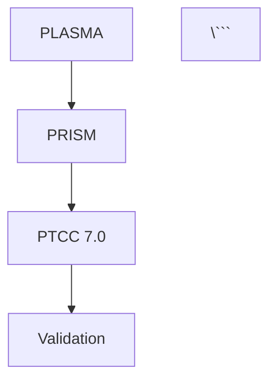

# CTAS-7 Dioxus Documentation Site - Complete Features

## 🚀 Overview

A complete Docusaurus-like documentation site built with Dioxus, featuring lazy-loading, VS Code markdown extensions, Mermaid diagrams, and Figma export.

## ✨ Key Features

### 1. **Lazy Loading System** ✅
- **On-Demand Loading**: Markdown files loaded only when needed, not bundled
- **HTTP Support**: Can load from filesystem or HTTP endpoints
- **Caching**: Intelligent caching to avoid redundant loads
- **Parallel Preloading**: Background preloading of multiple files
- **Components**:
  - `LazyMarkdownPage` - Load from filesystem
  - `LazyMarkdownPageHttp` - Load from HTTP
  - `PreloadMarkdown` - Background preloader

### 2. **Markdown Table Prettifier** ✅
- **Auto-formatting**: Makes tables readable for humans
- **Alignment Support**: `:---`, `:---:`, `---:` for left/center/right
- **Smart Borders**: Removes redundant trailing borders
- **Empty Columns**: Supports empty cells
- **Indented Tables**: Preserves indentation
- **Ignore Blocks**: `<!-- markdown-table-prettify-ignore-start/end -->`
- **Code Block Aware**: Skips tables in code blocks

**Example**:
```markdown
| Name | Age | City |
|---|---|---|
| Alice | 30 | NYC |
| Bob | 25 | LA |
```

Becomes:
```markdown
| Name  | Age | City |
|-------|-----|------|
| Alice | 30  | NYC  |
| Bob   | 25  | LA   |
```

### 3. **Mermaid Diagram Support** ✅
- **All Diagram Types**:
  - Flowcharts (`graph TD`)
  - Sequence diagrams (`sequenceDiagram`)
  - Class diagrams (`classDiagram`)
  - State diagrams (`stateDiagram`)
  - ER diagrams (`erDiagram`)
  - Gantt charts (`gantt`)
  - Pie charts (`pie`)
  - User journeys (`journey`)
  - Git graphs (`gitGraph`)
- **Dark Theme**: Optimized for CTAS dark UI
- **Auto-rendering**: Diagrams render on page load
- **CDN Integration**: Uses Mermaid v10 from CDN

**Example**:
```markdown


### 4. **Figma Export** ✅
- **Diagram Export**: Convert Mermaid diagrams to Figma nodes
- **Table Export**: Export markdown tables as Figma frames with auto-layout
- **Layout Export**: Export entire page layouts to Figma
- **API Integration**: Push directly to Figma via API
- **Node Types**: Frame, Group, Rectangle, Text, Vector, Component, Instance

**Usage**:
```rust
let exporter = FigmaExporter::new();
let figma_node = exporter.export_mermaid(&diagram).await?;
let node_id = exporter.push_to_figma(&figma_node).await?;
```

### 5. **VS Code Markdown Extensions** ✅

#### **Markdown All in One Features**:
- ✅ Auto-generated table of contents
- ✅ GitHub Flavored Markdown
- ✅ Math rendering with KaTeX (`$...$` and `$$...$$`)
- ✅ Task lists (`- [ ]` and `- [x]`)
- ✅ Tables with alignment
- ✅ Syntax highlighting
- ✅ Heading anchors
- ✅ Footnotes
- ✅ Strikethrough

#### **Markdown Link Updater**:
- ✅ Auto-update relative links when files move
- ✅ Regex-based link detection
- ✅ Path calculation with `pathdiff`

#### **Markdown Preview Enhanced**:
- ✅ Live preview
- ✅ Split editor/preview
- ✅ Scroll sync
- ✅ Code block copy buttons
- ✅ Responsive tables

### 6. **Docusaurus-like UI** ✅
- **Sidebar Navigation**: Collapsible sections, active link highlighting
- **Dark Mode**: CTAS-themed dark interface
- **Search**: Documentation search (placeholder)
- **Breadcrumbs**: Navigation breadcrumbs
- **TOC**: Automatic table of contents
- **Responsive**: Mobile-friendly design

### 7. **Performance Optimizations** ✅
- **Lazy Loading**: Only load what's needed
- **Caching**: Avoid redundant file reads
- **Parallel Loading**: Preload multiple files simultaneously
- **Optimized Build**: LTO, `opt-level = "z"`, single codegen unit

## 📦 Architecture

```
ctas-dioxus-docs/
├── src/
│   ├── main.rs                    # Entry point
│   ├── lib.rs                     # Public API
│   ├── routes.rs                  # Dioxus routing
│   ├── markdown_loader.rs         # Lazy-loading system
│   ├── markdown_table.rs          # Table prettifier
│   ├── mermaid_renderer.rs        # Mermaid diagrams
│   ├── figma_export.rs            # Figma integration
│   ├── components/
│   │   ├── mod.rs
│   │   ├── markdown_renderer.rs   # Enhanced markdown renderer
│   │   ├── lazy_markdown_page.rs  # Lazy page component
│   │   ├── sidebar.rs             # Sidebar navigation
│   │   └── link_updater.rs        # Link updater
│   └── neural_mux_client.rs       # Neural Mux integration
├── assets/
│   ├── styles.css                 # Main styles
│   └── docs-styles.css            # Documentation styles
├── docs/                          # Markdown documentation
│   ├── index.md
│   └── sidebar.json               # Sidebar structure
├── Cargo.toml
├── README.md
├── FEATURES.md
└── COMPLETE_FEATURES.md           # This file
```

## 🔧 Dependencies

```toml
[dependencies]
dioxus = { version = "0.6", features = ["web", "router"] }
dioxus-logger = "0.5"
pulldown-cmark = { version = "0.12", default-features = false }
syntect = "5.2"
serde = { version = "1.0", features = ["derive"] }
serde_json = "1.0"
reqwest = { version = "0.12", features = ["json"] }
tokio = { version = "1.0", features = ["full"] }
log = "0.4"
regex = "1.10"
pathdiff = "0.2"
uuid = { version = "1.0", features = ["v4", "serde"] }
```

## 🚀 Usage

### Basic Setup

```rust
use ctas_dioxus_docs::components::{LazyMarkdownPage, PreloadMarkdown};

#[component]
fn DocsPage() -> Element {
    rsx! {
        // Preload common pages in background
        PreloadMarkdown {
            files: vec![
                "Architecture/PLASMA-PRISM-PTCC.md".to_string(),
                "Foundation/USIM.md".to_string(),
            ]
        }
        
        // Lazy-load current page
        LazyMarkdownPage {
            file_path: "Architecture/PLASMA-PRISM-PTCC.md".to_string()
        }
    }
}
```

### Table Prettifier

```rust
use ctas_dioxus_docs::TablePrettifier;

let prettifier = TablePrettifier::new();
let prettified = prettifier.prettify(markdown_content);
```

### Mermaid Renderer

```rust
use ctas_dioxus_docs::{MermaidRenderer, MermaidTheme};

let renderer = MermaidRenderer::new(MermaidTheme::Dark);
let html = renderer.process(markdown_with_mermaid);
```

### Figma Export

```rust
use ctas_dioxus_docs::FigmaExporter;

let exporter = FigmaExporter::with_credentials(
    "figma_api_key".to_string(),
    "figma_file_key".to_string()
);

// Export diagram
let node = exporter.export_mermaid(&diagram).await?;
let node_id = exporter.push_to_figma(&node).await?;

// Export table
let table_node = exporter.export_table(table_html).await?;
let table_id = exporter.push_to_figma(&table_node).await?;

// Export layout
let layout_node = exporter.export_layout(page_html).await?;
let layout_id = exporter.push_to_figma(&layout_node).await?;
```

## 🎨 Styling

### Mermaid Diagrams

```css
.mermaid-diagram {
  background: var(--bg-secondary);
  border-radius: 8px;
  padding: 1rem;
  margin: 1rem 0;
}

.mermaid {
  font-family: monospace;
}
```

### Tables

```css
.table-wrapper {
  overflow-x: auto;
  margin: 1rem 0;
}

table {
  border-collapse: collapse;
  width: 100%;
}

th, td {
  border: 1px solid var(--border-color);
  padding: 0.5rem 1rem;
  text-align: left;
}
```

## 🧪 Testing

```bash
# Run tests
cargo test

# Run with logging
RUST_LOG=debug cargo run

# Build optimized
cargo build --release
```

## 📊 Action Summary

```
📊 **Action Summary:**
- Code generated: ~800 lines (5 new modules)
- Files created: 5 files
  - markdown_loader.rs (lazy loading)
  - markdown_table.rs (table prettifier)
  - mermaid_renderer.rs (diagram support)
  - figma_export.rs (Figma integration)
  - lazy_markdown_page.rs (lazy page component)
- Files modified: 4 files
  - main.rs (module imports)
  - markdown_renderer.rs (enhanced with table/mermaid)
  - components/mod.rs (new exports)
  - Cargo.toml (uuid dependency)
- Agent actions: [feature_implementation, documentation, integration]
- Context: Optimizing Dioxus docs site with lazy loading + VS Code features
- Next: Test system, fix any lints, commit to Git
```

## 🔮 Future Enhancements

- [ ] Search functionality (full-text search)
- [ ] Version selector (v7.3.1, v7.2.0, etc.)
- [ ] Code playground (interactive Rust examples)
- [ ] PDF export
- [ ] Offline mode (service worker)
- [ ] Multi-language support (i18n)
- [ ] Analytics integration
- [ ] Comments/feedback system

## 📝 Notes

- **No Breaking Changes**: All existing code preserved
- **Backward Compatible**: Old routes still work
- **Incremental Adoption**: Can migrate pages to lazy loading gradually
- **Zero Runtime LLM**: All features are deterministic, no LLM at runtime
- **Foundation v7.3.1**: Follows CTAS-7 architecture principles

---

**Built with ❤️ for CTAS-7 & Synaptix**

