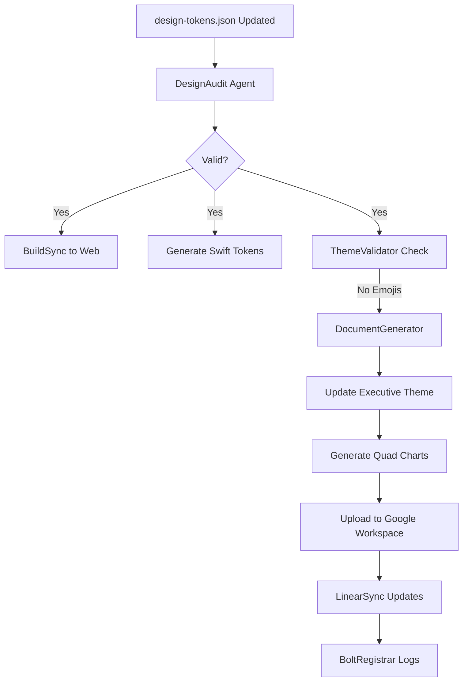

# 🎨 SYNAPTIX DESIGN SYSTEM INTEGRATION

**Canonical Source:** https://github.com/cp5337/ctas7-v0-design-system-framework-react-native  
**Integration Date:** November 7, 2025  
**Purpose:** Unify React Native, Web, and Executive Presentations  

---

## 🎯 **ARCHITECTURE**

```
┌─────────────────────────────────────────────────────────┐
│ Canonical React Native Repo (Source of Truth)          │
│ github.com/cp5337/ctas7-v0-design-system-framework     │
│ design-tokens.json                                      │
└────────────────────┬────────────────────────────────────┘
                     │
        ┌────────────┴────────────┬─────────────────────┐
        │                         │                     │
        ▼                         ▼                     ▼
┌──────────────┐    ┌──────────────────┐   ┌──────────────────┐
│  Web App     │    │  iOS Native      │   │  Executive Docs  │
│  Next.js     │    │  SwiftUI         │   │  Google Workspace│
│  RN Web      │    │  Transpiled      │   │  Figma/Canva     │
└──────────────┘    └──────────────────┘   └──────────────────┘
```

---

## 🎨 **COLOR PALETTE ALIGNMENT**

### **From design-tokens.json:**

```json
{
  "color": {
    "primary": { "value": "#38bdf8" },  // Synaptix Blue
    "background": {
      "primary": { "value": "#0f172a" }  // Dark background
    }
  }
}
```

### **Map to Synaptix Executive Theme:**

| React Native Token | Synaptix Variable | Hex Value | Usage |
|-------------------|-------------------|-----------|-------|
| `color.primary` | `--synaptix-blue` | `#3B82F6` | Primary accent (close match) |
| `color.background.primary` | `--synaptix-bg-primary` | `#0A0E17` | Main background (darker) |
| `color.background.secondary` | `--synaptix-bg-secondary` | `#131824` | Cards/panels |
| `color.text.primary` | `--synaptix-text-primary` | `#F8FAFC` | Primary text |

**Recommendation:** Update `design-tokens.json` to match executive palette:

```json
{
  "color": {
    "primary": { "value": "#3B82F6" },
    "background": {
      "primary": { "value": "#0A0E17" },
      "secondary": { "value": "#131824" },
      "tertiary": { "value": "#1A2030" }
    },
    "text": {
      "primary": { "value": "#F8FAFC" },
      "secondary": { "value": "#CBD5E1" },
      "muted": { "value": "#64748B" }
    },
    "status": {
      "success": { "value": "#10B981" },
      "warning": { "value": "#F59E0B" },
      "danger": { "value": "#EF4444" }
    }
  }
}
```

---

## 📐 **TYPOGRAPHY ALIGNMENT**

### **From design-tokens.json:**

```json
{
  "typography": {
    "fontSize": {
      "base": { "value": 16 }
    }
  }
}
```

### **Match Synaptix Executive:**

```json
{
  "typography": {
    "fontFamily": {
      "primary": { "value": "Inter, -apple-system, BlinkMacSystemFont, 'Segoe UI', sans-serif" }
    },
    "fontSize": {
      "xs": { "value": 12 },
      "sm": { "value": 14 },
      "base": { "value": 16 },
      "lg": { "value": 18 },
      "xl": { "value": 20 },
      "2xl": { "value": 24 },
      "3xl": { "value": 32 },
      "4xl": { "value": 42 }
    },
    "fontWeight": {
      "regular": { "value": 400 },
      "medium": { "value": 500 },
      "semibold": { "value": 600 },
      "bold": { "value": 700 },
      "extrabold": { "value": 800 }
    },
    "letterSpacing": {
      "tight": { "value": "-0.02em" },
      "normal": { "value": "0em" },
      "wide": { "value": "0.05em" },
      "wider": { "value": "0.1em" }
    }
  }
}
```

---

## 🤖 **AGENT SYSTEM INTEGRATION**

### **Existing Agents (from pipeline.json):**

1. **BuildSync** - Mirrors code changes
2. **DesignAudit** - Validates design tokens
3. **iOSValidator** - Apple HIG compliance
4. **LLMTrainer** - Feeds examples to CTAS Forge
5. **BoltRegistrar** - Syncs to Bolt DB

### **Add Synaptix Agents:**

6. **DocumentGenerator** - Creates executive presentations
7. **LinearSync** - Updates project tracking
8. **ThemeValidator** - Ensures NO emojis, professional only

### **Updated pipeline.json:**

```json
{
  "meta-agent": "PipelineSupervisor",
  "agents": [
    {
      "id": "buildsync",
      "name": "BuildSync",
      "port": 50059,
      "role": "Mirrors canonical React Native to web"
    },
    {
      "id": "designaudit",
      "name": "DesignAudit",
      "port": 50060,
      "role": "Validates design-tokens.json parity"
    },
    {
      "id": "iosvalidator",
      "name": "iOSValidator",
      "port": 50061,
      "role": "Apple HIG and WebKit compliance"
    },
    {
      "id": "llmtrainer",
      "name": "LLMTrainer",
      "port": 50062,
      "role": "Feeds hybrid examples to CTAS Forge"
    },
    {
      "id": "boltregistrar",
      "name": "BoltRegistrar",
      "port": 50063,
      "role": "Syncs operational metadata to Bolt DB"
    },
    {
      "id": "documentgenerator",
      "name": "DocumentGenerator",
      "port": 50064,
      "role": "Creates executive presentations from design tokens"
    },
    {
      "id": "linearsync",
      "name": "LinearSync",
      "port": 50065,
      "role": "Updates Linear with design system changes"
    },
    {
      "id": "themevalidator",
      "name": "ThemeValidator",
      "port": 50066,
      "role": "Ensures NO emojis, professional design only"
    }
  ],
  "integrations": {
    "bolt_db": "https://bolt.ctas.dev/ops/ingest",
    "linear": "https://linear.app/cognetixalpha/team/COG",
    "google_workspace": "https://drive.google.com",
    "figma": "https://figma.com/@synaptix"
  }
}
```

---

## 🔄 **SYNCHRONIZATION WORKFLOW**



---

## 📱 **TOUCH TARGET COMPLIANCE**

### **From React Native Framework:**

- Minimum touch target: **44x44px** (Apple HIG)
- Interactive elements: Buttons, links, form inputs
- Spacing: Adequate around all touchable areas

### **Apply to Executive Presentations:**

- All clickable elements in Figma/Canva: **44x44px minimum**
- Progress bar hit areas: **36px height** (meets 44px with padding)
- Status badges: **32px height** (non-interactive, OK)
- Quad chart cards: Touch-friendly spacing (32px gaps)

---

## 🎨 **COMPONENT MAPPING**

### **React Native → SwiftUI → Executive Docs:**

| React Native | SwiftUI | Executive Docs | Purpose |
|--------------|---------|----------------|---------|
| `<View>` | `VStack/HStack` | Card/Container | Layout |
| `<Text>` | `Text` | Heading/Body | Typography |
| `<Pressable>` | `Button` | Interactive Element | Actions |
| `StatusBadge` | `Badge` | Status Indicator | State |
| `ProgressBar` | `ProgressView` | Progress Indicator | Metrics |

---

## 🔧 **IMPLEMENTATION STEPS**

### **1. Clone React Native Framework:**

```bash
cd /Users/cp5337/Developer
git clone https://github.com/cp5337/ctas7-v0-design-system-framework-react-native
cd ctas7-v0-design-system-framework-react-native
```

### **2. Update design-tokens.json:**

```bash
# Backup current tokens
cp design-tokens.json design-tokens.backup.json

# Update with Synaptix executive palette
cat > design-tokens.json << 'EOF'
{
  "color": {
    "primary": { "value": "#3B82F6" },
    "background": {
      "primary": { "value": "#0A0E17" },
      "secondary": { "value": "#131824" },
      "tertiary": { "value": "#1A2030" }
    },
    "text": {
      "primary": { "value": "#F8FAFC" },
      "secondary": { "value": "#CBD5E1" },
      "muted": { "value": "#64748B" }
    },
    "status": {
      "success": { "value": "#10B981" },
      "warning": { "value": "#F59E0B" },
      "danger": { "value": "#EF4444" }
    }
  },
  "typography": {
    "fontFamily": {
      "primary": { "value": "Inter" }
    },
    "fontSize": {
      "base": { "value": 16 },
      "lg": { "value": 18 },
      "xl": { "value": 20 },
      "2xl": { "value": 24 },
      "3xl": { "value": 32 },
      "4xl": { "value": 42 }
    }
  },
  "spacing": {
    "xs": { "value": 8 },
    "sm": { "value": 16 },
    "md": { "value": 24 },
    "lg": { "value": 32 },
    "xl": { "value": 48 }
  }
}
EOF
```

### **3. Generate Token Exports:**

```bash
# Install dependencies
npm install

# Generate CSS, Swift, Kotlin tokens
npm run generate:tokens

# Outputs:
# - src/tokens/tokens.css (CSS variables)
# - src/tokens/Tokens.swift (Swift extensions)
# - src/tokens/Tokens.kt (Kotlin objects)
```

### **4. Update Executive Theme Generator:**

```bash
cd /Users/cp5337/Developer/ctas7-command-center

# Import design tokens
cp ../ctas7-v0-design-system-framework-react-native/design-tokens.json design-system/

# Regenerate executive theme
node subagent-tasks/generate-executive-dark-theme.cjs
```

### **5. Sync to Google Workspace:**

```bash
# Upload with updated tokens
node subagent-tasks/upload-to-google-workspace.cjs
```

---

## ✅ **VALIDATION CHECKLIST**

- [ ] design-tokens.json matches Synaptix executive palette
- [ ] NO emojis in any generated components
- [ ] Touch targets ≥44px for interactive elements
- [ ] Dark mode only (no light theme)
- [ ] Inter font family used throughout
- [ ] WCAG 2.1 AA contrast ratios met
- [ ] All agents added to pipeline.json
- [ ] CI/CD pipeline includes ThemeValidator
- [ ] Generated quad charts use design tokens
- [ ] Google Workspace uploads use consistent styling

---

## 🔗 **INTEGRATION POINTS**

### **1. Command Center:**

```javascript
// Import design tokens
import tokens from '@/design-tokens.json';

// Use in React components
const styles = {
  background: tokens.color.background.primary.value,
  color: tokens.color.text.primary.value,
  fontSize: tokens.typography.fontSize.base.value
};
```

### **2. iOS Native:**

```swift
// Auto-generated from design-tokens.json
import SynaptixTokens

struct ContentView: View {
    var body: some View {
        VStack {
            Text("Synaptix")
                .foregroundColor(Tokens.Color.text.primary)
                .font(.system(size: Tokens.Typography.fontSize.xl))
        }
        .background(Tokens.Color.background.primary)
    }
}
```

### **3. Executive Presentations:**

```javascript
// Generate Google Slides with tokens
const COLORS = {
  primary: tokens.color.primary.value,
  bgPrimary: tokens.color.background.primary.value,
  textPrimary: tokens.color.text.primary.value
};
```

---

## 📊 **BENEFITS**

1. **Single Source of Truth** - design-tokens.json defines all design
2. **Cross-Platform Consistency** - Web, iOS, Android, Docs all match
3. **Automated Sync** - CI/CD pipeline keeps everything aligned
4. **Agent-Driven** - No manual token conversion needed
5. **Executive Professional** - NO emojis, dark theme, 44px touch targets
6. **Type-Safe** - TypeScript, Swift, Kotlin exports
7. **Scalable** - Add new tokens, regenerate everywhere

---

## 🚀 **NEXT STEPS**

1. **Clone React Native framework** to Developer folder
2. **Update design-tokens.json** with Synaptix palette
3. **Add new agents** (DocumentGenerator, ThemeValidator)
4. **Regenerate all exports** (CSS, Swift, Kotlin)
5. **Update executive theme generator** to use tokens
6. **Test full pipeline** (tokens → quad chart → Google Workspace)
7. **Deploy to Vercel** (https://ctas-react-native-web.vercel.app)

---

## 📚 **REFERENCES**

- **React Native Framework:** https://github.com/cp5337/ctas7-v0-design-system-framework-react-native
- **Design Tokens Spec:** https://design-tokens.github.io/community-group/format/
- **Apple HIG:** https://developer.apple.com/design/human-interface-guidelines/
- **WCAG 2.1:** https://www.w3.org/WAI/WCAG21/quickref/

---

**Unified Design System. One Source of Truth. Cross-Platform Excellence.** ✓

