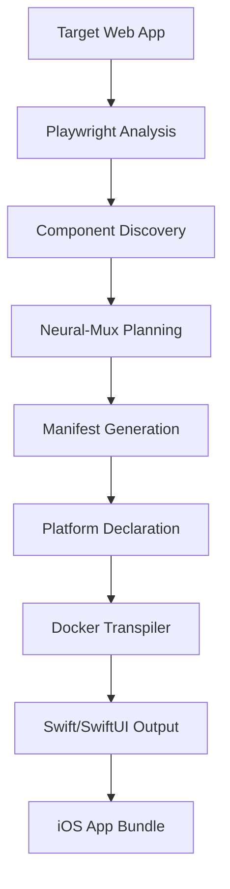

# CTAS-7 Intelligent Transpiler System

## 🎯 Project Overview

**Mission:** Automated conversion of React Native Web applications to native iOS/macOS/iPadOS applications using AI-driven analysis and intelligent transpilation.

**Status:** Architecture Complete | Implementation: Future Linear Initiative

## 🏗️ System Architecture

### Core Components

#### 1. Site Analysis Engine
- **Crawler + Playwright** deep analysis of target applications
- Component discovery and interaction mapping
- Data flow analysis and dependency graphing
- Platform constraint identification

#### 2. Intelligent Manifest Generator
- **Neural-Mux powered** conversion planning
- Custom 34-step plans per application
- Platform-specific implementation strategies
- Declarative conversion specifications

#### 3. Containerized Transpiler
- **Docker-based** conversion engine
- Multi-platform targeting (macOS, iPhone, iPad)
- Terraform-style declarative output
- Rust-Swift FFI bridge generation

#### 4. Agent Orchestration
- **MCP routing** for complex workflows
- BuildSync, DesignAudit, iOSValidator agents
- Continuous integration pipeline
- App Store deployment automation

## 🔄 Process Flow



### Detailed Workflow

1. **Site Analysis**
   ```typescript
   const analysis = await playwright.analyze({
     url: 'https://target-app.com',
     targetPlatforms: ['macos', 'iphone', 'ipad'],
     depth: 'full',
     components: true,
     interactions: true
   })
   ```

2. **Manifest Generation**
   ```typescript
   const manifest = await neuralMux.generateManifest({
     siteAnalysis,
     platforms: ['macos', 'iphone', 'ipad'],
     backend: 'rust',
     frontend: 'swiftui'
   })
   ```

3. **Containerized Transpilation**
   ```dockerfile
   FROM swift-multiplatform:latest
   ENV TARGET_PLATFORMS="macos,ios-iphone,ios-ipad"
   COPY manifest.json ./
   RUN ./generate-universal-app --platforms=$TARGET_PLATFORMS
   ```

## 🎨 Component Library Integration

### Recovered Assets
- **34+ Tutorial Lessons** (React Native → Swift conversion)
- **6 Visualization Components** (RadialGauge, LinearMeter, TelemetryChart, etc.)
- **50+ shadcn/ui Components** (Complete design system)
- **Agent Pipeline System** (BuildSync, DesignAudit, iOSValidator, LLMTrainer)

### Platform-Specific Adaptations
- **iPhone:** UINavigationController, compact layouts, touch interactions
- **iPad:** UISplitViewController, adaptive layouts, touch + pencil
- **macOS:** NSWindowController, menu bars, mouse + keyboard interactions

## 🦀 Rust-iOS Integration

### Architecture Benefits
- **Rust Core Logic:** High-performance, memory-safe business logic
- **Swift UI Layer:** iOS-compliant, App Store ready interfaces
- **FFI Bridge:** Seamless Rust-Swift interoperability

### Implementation Pattern
```rust
// Rust core (high-performance)
#[no_mangle]
pub extern "C" fn process_telemetry_data(data: *const u8) -> *mut TelemetryResult {
    // Fast, safe processing
}
```

```swift
// Swift UI (iOS-compliant)
struct GroundStationView: View {
    var body: some View {
        RadialGauge(value: RustCore.processTelemetry(data))
    }
}
```

## 🚀 Development Strategy

### Two-Stage Approach

#### Stage 1: Rapid Development
- Build in **React Native/TypeScript** for speed
- Iterate quickly, test concepts
- Focus on functionality over platform constraints

#### Stage 2: Production Transpilation
- Generate **iOS-compliant** native versions
- Optimize for App Store deployment
- Preserve logic, enhance performance

### Benefits
- **No cannibalization** of development speed
- **Best of both worlds** (dev speed + native performance)
- **Production enhancement pipeline** rather than development constraint

## 🎯 Target Use Cases

### Phase 1 (Small Projects)
- **CogniGraph:** iOS visualization tool
- **Neural-Mux Mobile:** iPhone version of mux router
- **iPhone PLC MVP:** Industrial control interface
- **Additional utility apps**

### Phase 2 (Enterprise Applications)
- Command center → iOS conversion
- Ops system mobile interfaces
- Ground station control apps
- Multi-platform deployment pipeline

## 🔗 Integration Points

### Neural-Mux Router
- Intelligent conversion routing
- Context-aware transpilation decisions
- Adaptive tutorial progression
- Smart component generation

### MCP Server Integration
- Agent orchestration
- Cross-platform deployment
- Continuous integration
- Quality assurance automation

### CTAS-7 Foundation
- Trivariate hashing integration
- Legion ECS coordination
- Multi-database bridging
- Space world entity management

## 📦 Container Architecture

### Tutorial Framework Container
```dockerfile
# tutorial-framework:latest
FROM node:18-alpine
COPY tutorial/ ./
COPY agents/ ./agents/
EXPOSE 3000
CMD ["npm", "run", "dev"]
```

### Transpilation Engine Container
```dockerfile
# react-swift-transpiler:latest
FROM swift:5.8
RUN apt-get update && apt-get install -y nodejs npm
COPY transpiler/ ./
EXPOSE 8080
CMD ["./transpile-server"]
```

## 🛡️ Lessons Learned

### Critical Success Factors
1. **Platform declaration upfront** (avoid view system conflicts)
2. **Containerized isolation** (consistent builds across environments)
3. **Site-specific manifests** (intelligent conversion plans vs. generic tutorials)
4. **Two-stage development** (React Native → native when ready)

### Previous Failure Points
- View system conflicts from late platform targeting
- Mixed development constraints
- Generic tutorials vs. intelligent conversion
- Environment inconsistencies

## 📋 Implementation Roadmap

### Linear Initiative Breakdown

#### Epic 1: Core Infrastructure
- [ ] Site analysis engine (Playwright integration)
- [ ] Neural-Mux manifest generator
- [ ] Docker transpiler foundation
- [ ] MCP agent orchestration

#### Epic 2: Platform Support
- [ ] iPhone/iOS transpilation
- [ ] iPad adaptive layouts
- [ ] macOS desktop patterns
- [ ] Universal app generation

#### Epic 3: Rust Integration
- [ ] FFI bridge generator
- [ ] Swift binding automation
- [ ] Performance optimization
- [ ] Memory safety validation

#### Epic 4: Production Pipeline
- [ ] CI/CD integration
- [ ] App Store compliance
- [ ] Automated testing
- [ ] Deployment automation

## 🔮 Future Enhancements

### AI-Driven Optimization
- Component usage pattern learning
- Performance bottleneck prediction
- Adaptive UI generation
- User behavior optimization

### Extended Platform Support
- Android native transpilation
- Web assembly targets
- Desktop application generation
- Cross-platform synchronization

### Enterprise Features
- Multi-tenant deployment
- Custom branding injection
- Enterprise security compliance
- Scalable conversion pipelines

## 📚 Resources

### Recovered Tutorial Content
- **Location:** `/Users/cp5337/Developer/ctas7-command-center/extracted-tutorial/`
- **Components:** 114 files including visualization components
- **Safety Docs:** `PUSH-TO-GIT-SAFELY.md`

### Integration Documentation
- **Neural-Mux:** Cognitive routing system
- **CTAS-7 Foundation:** Space world integration
- **MCP Agents:** Orchestration framework

---

**Status:** Ready for Linear Initiative Creation
**Priority:** Medium (after ops system conversion)
**Estimated Effort:** 3-6 months full implementation
**Success Metrics:** Successful conversion of CogniGraph, Neural-Mux Mobile, iPhone PLC MVP